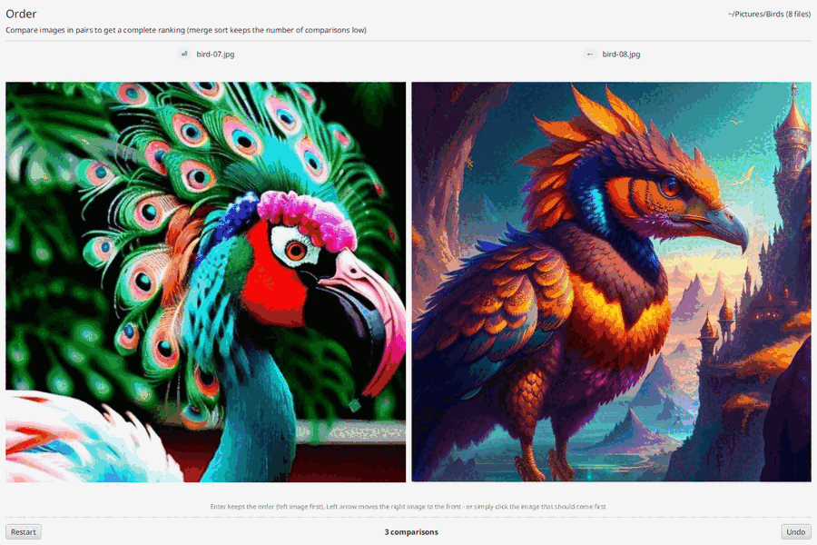
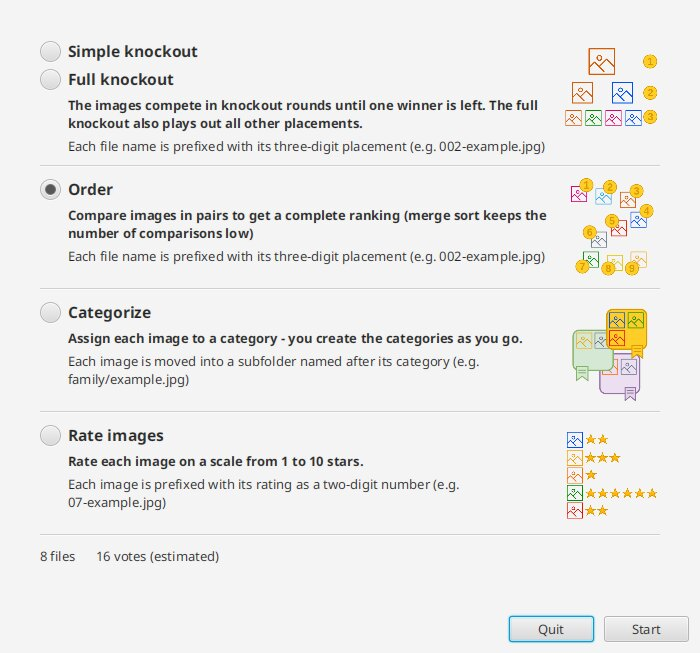
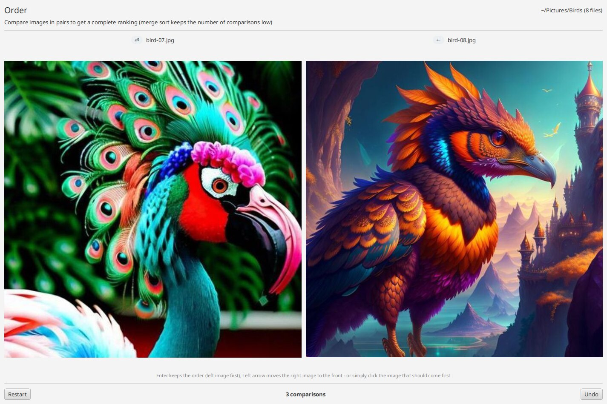
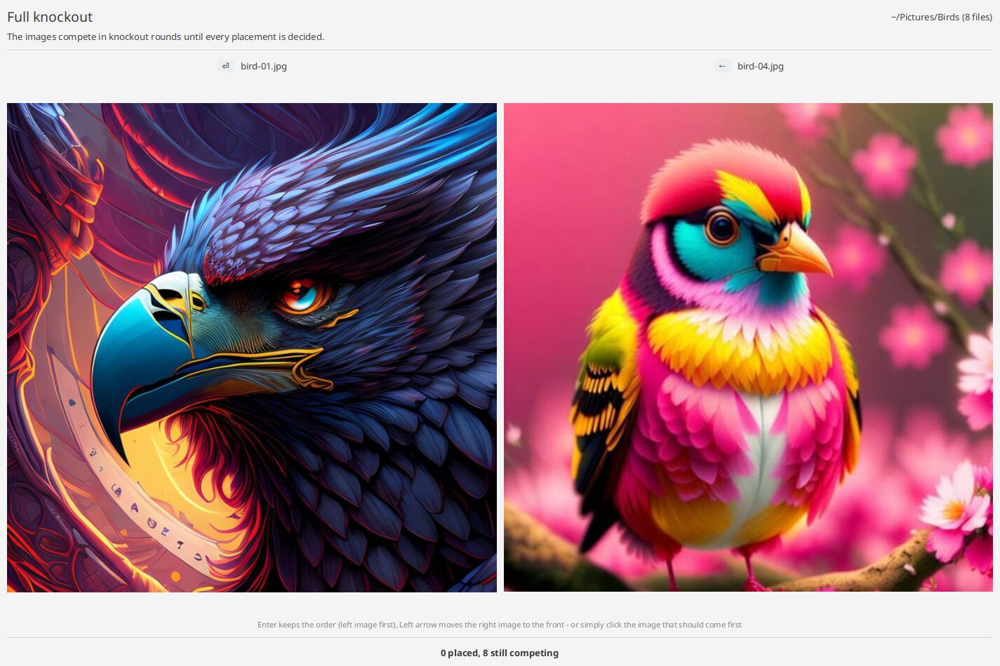
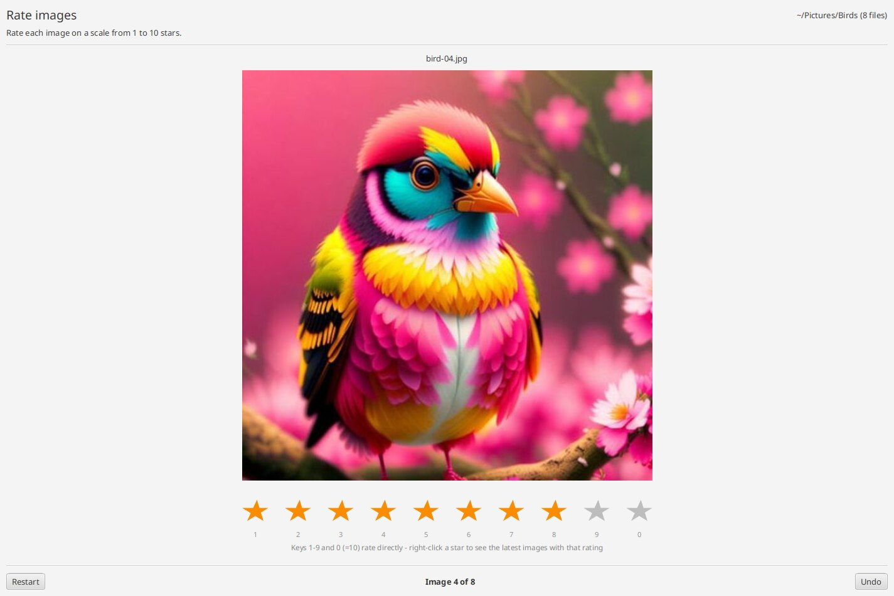
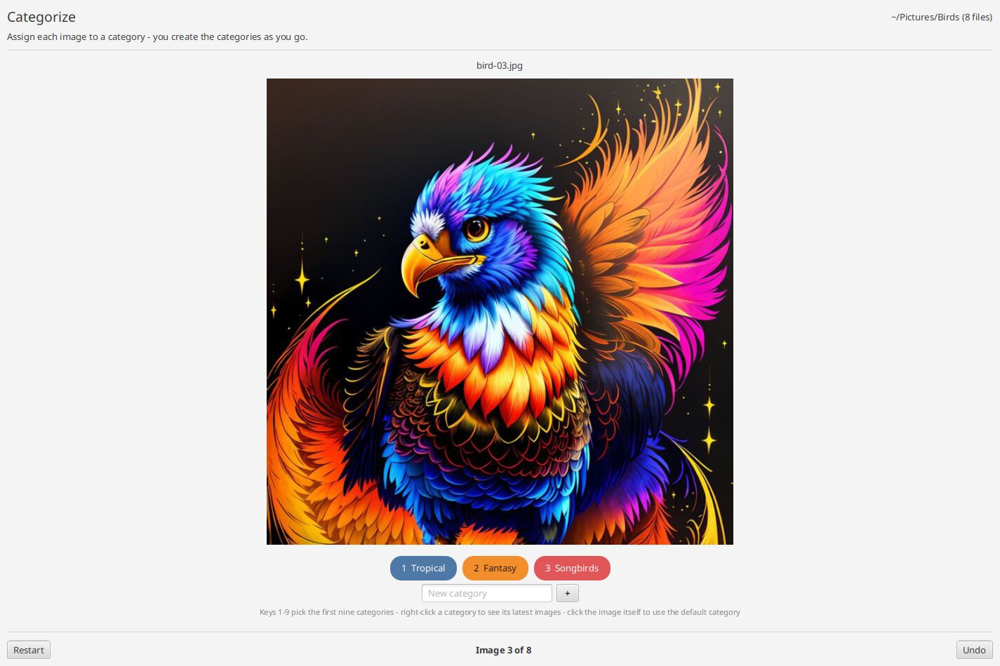
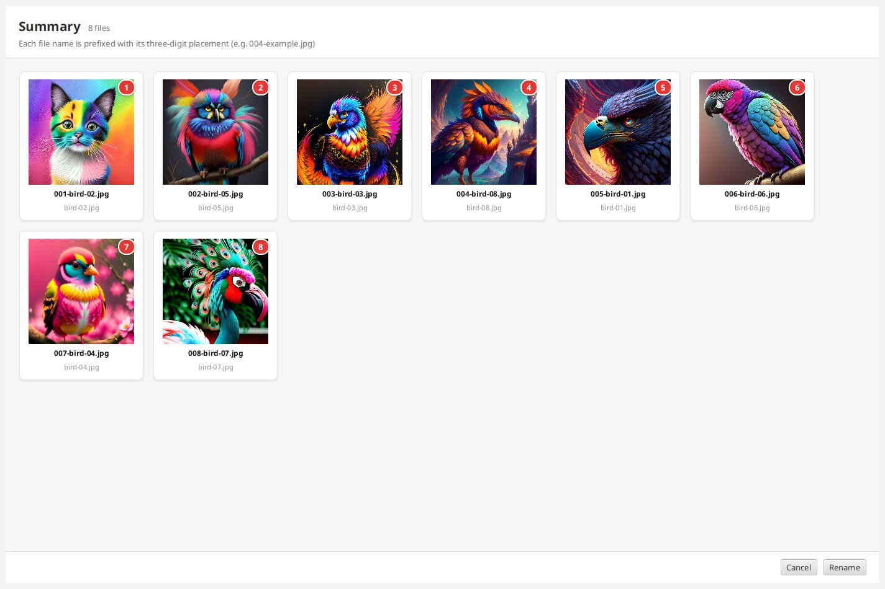

<p align="center">
  
</p>

<h1 align="center">Image Organizr (iorg)</h1>

<p align="center">
  <b>Sort, rank and rate a folder full of photos - one quick decision at a time.</b>
</p>

<p align="center">
  <a href="https://github.com/Skrrytch/ImageOrganizr/releases/latest"></a>
  <a href="https://github.com/Skrrytch/ImageOrganizr/actions/workflows/build.yml"></a>
  <a href="LICENSE"></a>
  
</p>

<p align="center">
  
</p>

Picking the best 20 out of 300 holiday photos is tiring when you look at all of them at once. **iorg** shows you one
image or one pair of images at a time and asks a single question: *Which one is better?*, *How many stars?* or
*Which category?* When you are done, it **renames the files or moves them into folders**, so any file manager or photo
viewer shows your result - no database, no import, no lock-in.

- **Five modes**: pairwise ranking, two knockout tournaments, star rating and categorizing
- **Keyboard first**: Enter, Left arrow and the number keys - your hands never have to leave the keyboard
- **Few comparisons**: ranking uses merge sort, so 100 images need about 560 comparisons instead of 4,950 for every pair
- **Undo and restart** while you vote, and a visual summary before anything is changed on disk
- **Nothing to install besides the app**: the packages bring their own Java runtime
- English and German user interface

## Download

Get the latest version from the [**Releases page**](https://github.com/Skrrytch/ImageOrganizr/releases/latest):

| Platform | File                                     | Notes                                                                    |
|----------|------------------------------------------|--------------------------------------------------------------------------|
| Windows  | `ImageOrganizr-<version>-windows-x64.msi` | Installer with Start menu entry, no admin rights needed                  |
| Windows  | `ImageOrganizr-<version>-windows-x64.zip` | Portable: unzip and run `ImageOrganizr.exe`                              |
| Linux    | `imageorganizr_<version>_amd64.deb`       | Debian, Ubuntu, Mint, ...: `sudo apt install ./imageorganizr_*_amd64.deb` |
| Linux    | `ImageOrganizr-<version>-linux-x64.tar.gz` | Any distribution: unpack and run `ImageOrganizr/bin/ImageOrganizr`       |

> **Windows SmartScreen**: the installer is not code-signed yet, so Windows may warn about an unknown publisher.
> Click *More info* and then *Run anyway*.

macOS is not packaged yet. You can [build iorg from source](CONTRIBUTING.md#building-from-source) with Java 21.

## Quick start

1. Start iorg. If the current folder has no images, it asks you to choose a folder (JPG, JPEG and PNG are supported).
2. Pick a mode in the start dialog. It also shows how many votes to expect.
3. Vote until you are done, then check the summary.
4. Click **Rename** to apply the result - or **Cancel** to quit without touching a single file.



> [!IMPORTANT]
> iorg renames or moves the image files in the chosen folder when you click **Rename**. This cannot be undone from
> within iorg. If you are unsure, try it on a copy of your folder first.

## Modes

### Order - a complete ranking by comparing pairs

Two images are shown side by side. Press **Enter** to keep the left image first, or **Left arrow** to move the right
image to the front - or simply click the image that should come first. The order can mean anything: *better*, *older*,
*more important*.

iorg uses the merge sort algorithm to keep the number of comparisons low - about 16 for 8 images, 230 for 50 and 560
for 100, instead of comparing every image with every other one. Still, this is the mode with the most votes.

**Result**: each file name is prefixed with its three-digit placement, e.g. `001-beach.jpg`, `002-sunset.jpg`.

> **Tip**: For large collections, first split the images with *Categorize* and then order each category - or use a
> knockout mode if you only care about the top images.



### Knockout - find the winners fast

Like a tournament: images compete in pairs, the winner moves on to the next round, until one image is left.

- **Simple knockout** finds the winner with the fewest votes. The other placements are only rough groups.
- **Full knockout** keeps playing until every placement is decided.

Keep in mind that the placements after the top spots are less reliable than in *Order* mode: a good image can meet an
even better one in the first round and end up further down than it deserves.

**Result**: each file name is prefixed with its three-digit placement. In the simple knockout, several images can share
a placement.



### Rate - give every image 1 to 10 stars

The classic: look at each image and give it a rating. Press **1**-**9**, or **0** for ten stars, or click a star.
Right-click a star to see the last images you rated with it - handy to stay consistent.

**Result**: each file name is prefixed with its two-digit rating, e.g. `08-beach.jpg`, so a file manager sorts your
images by rating.



### Categorize - sort images into folders

Create categories as you go: type a name into the *New category* field and press Enter. Press **1**-**9** to assign
one of the first nine categories, or click a category. Right-click a category to see the last images in it. Clicking
the image itself puts it into the category `default`.

**Result**: each image is moved into a subfolder named after its category, e.g. `family/beach.jpg`.



### Summary

When all votes are cast, iorg shows every image with its result and its new file name. Nothing has been changed on
disk until you click **Rename**.



## Keyboard shortcuts

| Mode                | Key              | Action                                              |
|---------------------|------------------|-----------------------------------------------------|
| Order, Knockout     | Enter            | Keep the order - the left image comes first        |
| Order, Knockout     | Left arrow       | Move the right image to the front                   |
| Rate                | 1 - 9, 0         | Rate with 1 - 9 stars, 0 means 10 stars             |
| Categorize          | 1 - 9            | Assign one of the first nine categories             |
| Categorize          | Tab              | Jump into the *New category* field                  |

*Undo* and *Restart* are available as buttons in the order, rate and categorize modes.

## Command line

All parameters are optional:

```
ImageOrganizr [directory] [--mode=order|simple-knockout|full-knockout|rate|categorize] [--lang=en|de]
```

- **directory**: the folder with the images. Default: the current folder - or a folder dialog if it contains no images.
- **--mode**: skips the start dialog and starts the given mode right away.
- **--lang**: the language of the user interface. Default: the language of your operating system, English if it is
  neither English nor German.

The launcher is `ImageOrganizr.exe` in the installation folder on Windows and `/opt/imageorganizr/bin/ImageOrganizr`
after installing the `.deb` package.

## Roadmap

Ideas for the next versions - [tell me](https://github.com/Skrrytch/ImageOrganizr/discussions) what matters to you:

- Undo in the knockout modes
- Configurable results, e.g. copy instead of move, or suffix instead of prefix
- Write ratings into the image metadata (EXIF/XMP) instead of the file name
- macOS package

## Feedback and contributing

Feedback is very welcome! Report bugs in the [issues](https://github.com/Skrrytch/ImageOrganizr/issues), and share
ideas and questions in the [discussions](https://github.com/Skrrytch/ImageOrganizr/discussions). See
[CONTRIBUTING.md](CONTRIBUTING.md) for how to build and test iorg.

## License

[MIT](LICENSE) © Bert Speckels
